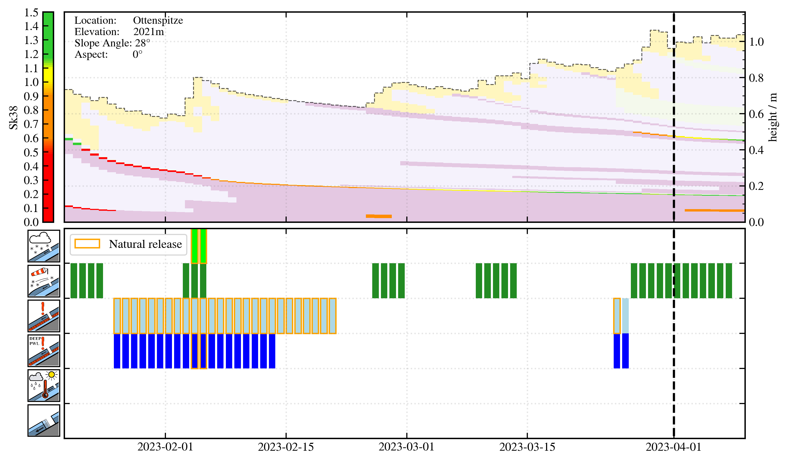
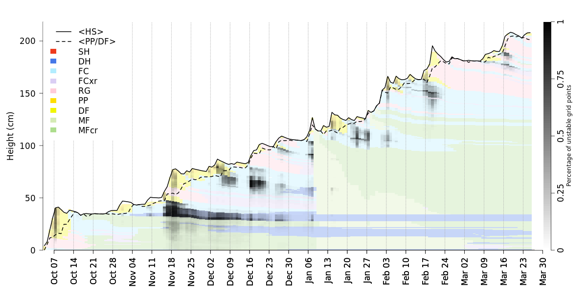

This package is a selection of tools useful for pre- and postprocessing of snowpack simulations. Check out their individual READMEs.

# caaml
A tool to prepare CAAMLv6 snow profile files to initialize Snowpack simulations. It mainly adds a parameterized density profile and required/optional metadata for the simmulation.

# SNOWPRO
A processing tool to parse .pro files and visualize the snowpack evolution

  

# AVAPRO
Assessment and Validation of Avalanche PROblems

  

# AGGREGATEPRO
A tool to compute a representative profile from a larger group of profiles and visualize layer stability distributions.

  

