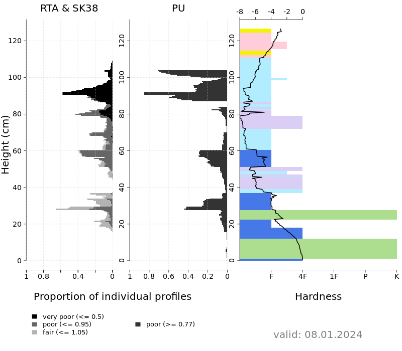

# Aggregatepro

**Aggregatepro** is a subpackage of the Python package `snowpacktools`. It implements computing of representative (*average*) snow profiles from a larger set of individual profiles (Herla et al, 2022). The subpackage currently contains one module `gridded` that allows users to aggregate gridded snowpack simulations into representative profiles. 

The package makes use of the R package [`sarp.snowprofile.alignment`](https://bitbucket.org/sfu-arp/sarp.snowprofile.alignment/src/master/) which runs the profile aggregation under the hood.

## Module `gridded`
The module will aggregate simulated snow profiles from given combinations of region, elevation band, and aspect into a representative profile. This representative profile can then be plotted as time series or traditional hand hardness profile. Instability distributions will be highlighted so that users can quickly understand which layers are modeled with largely poor instabilities and when these instabilities are most likely to occur. The currently implemented main stability tool is from Mayer et al (2022) and predicts **dry** snow layer instability based on skier triggering, called *p_unstable*.

Here is a representative snow profile for a small forecast subregion in northern Norway, 300-600 m asl, north facing 38 degree slope:

And here is a hand hardness profile from an unstable day early January, that compares the process-based dry snow instability index SK38 & RTA with p_unstable:    

### Usage
The module can be used in a bulk mode (research mode) or in an operational day-to-day mode, called either as script with command line arguments, or interactively within Python. The season mode allows to compute a time series of the representative profile for an entire season at a time. In an operational setting, the module aggregates the current day (and also several days of forecasts if available) before storing the intermediate results for the new computations the next day. On the next day, the previous lead-time forecasts will be overriden by more recent simulation data.

The module can be run efficiently and in parallel on multiple CPUs. It is feasible to apply the algorithm to groups of profiles counting up to few hundred profiles. Start with fewer profiles and explore computational demand as you increase the data sets.

**For more detailed documentation, particularly a list of dependencies and data requirements, see the module-level documentation provided by `gridded`.**

# References
1. Mayer, S., van Herwijnen, A., Techel, F., and Schweizer, J.: A random forest model to assess snow instability from simulated snow stratigraphy, The Cryosphere, 16, 4593–4615, https://doi.org/10.5194/tc-16-4593-2022, 2022.
2. Herla, F., Haegeli, P., and Mair, P.: A data exploration tool for averaging and accessing large data sets of snow stratigraphy profiles useful for avalanche forecasting, The Cryosphere, 16, 3149–3162, https://doi.org/10.5194/tc-16-3149-2022, 2022.