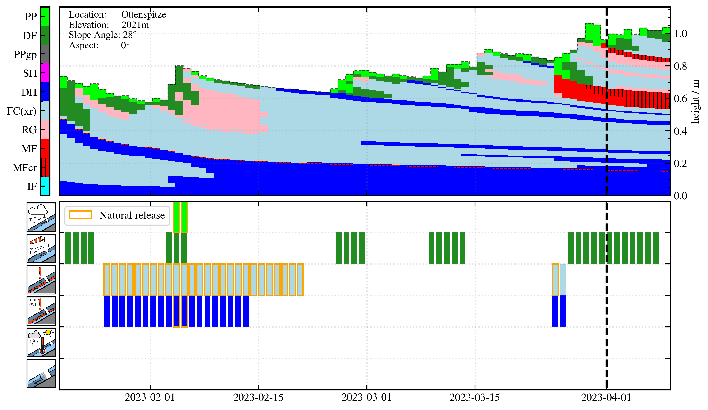
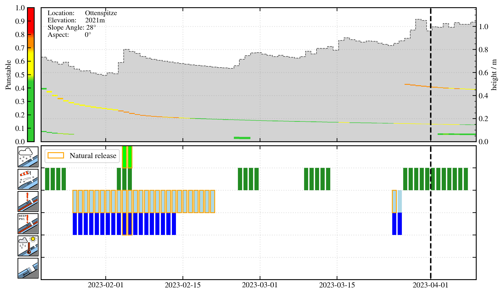

# AVAPro

AVAPro (Assesment and Validation of AVAlanche Problems) processes SNOWPACK output (.pro-files) and assigns the prevailing avalanche problems (see also https://avalanche.report/education/avalanche-problems) for each day of the simulation based on physical (and statistical analysis) of the snow stratigraphy and its evolution. Many algorithms and strategies are based on the work of Ben Reuter (https://www.sciencedirect.com/science/article/pii/S0165232X21002433?via%3Dihub) and have been adjusted for the operational use case. Currently the code is compatible with outputs generated by SNOWPACK (https://www.slf.ch/en/services-and-products/snowpack.html), but extending the toolchain to the output of Crocus (https://www.umr-cnrm.fr/spip.php?article265&lang=en) is possible. 

## Usage

AVAPro is part of the snowpacktools package of the avalanche warning service Tyrol. After installing the package, the avapro module can be imported into your toolchain and used by importing "from avapro import avapro" and specifying your own ini-file which is also provided with the package (folder config-files).

## Settings (ini-file)

In addition to setting up the relevant paths at the top of the ini-file, there are the following parameters

- DATE_OPERA: The date of the run (could be TODAY or some day in the past for reproduction)
- initilization_type: Either 'profile' or 'station' (refers to the simulation model chain, was the profile started from a snow profile?)
- drytime/wettime: timestamps of the snow profiles to be analyized
- season_start/season_end: relevant for setting up the analysis when simulating a station

  

  

  

Relevant references

Monti, F., & Schweizer, J. (2013). A relative difference approach to detect potential weak layers within a snow profile. In Proceedings ISSW (pp. 339-343).

Mayer, S., van Herwijnen, A., Techel, F., and Schweizer, J. (2022). A random forest model to assess snow instability from simulated snow stratigraphy, The Cryosphere, 16, 4593–4615, https://doi.org/10.5194/tc-16-4593-2022.

Herla, Florian & Horton, Simon & Mair, Patrick & Haegeli, Pascal. (2020). Snow profile alignment and similarity assessment for aggregating, clustering, and evaluating of snowpack model output for avalanche forecasting. 10.5194/gmd-2020-171.

Reuter, B., Viallon-Galinier, L., Horton, S., van Herwijnen, A., Mayer, S., Hagenmuller, P., & Morin, S. (2022). Characterizing snow instability with avalanche problem types derived from snow cover simulations. Cold Regions Science and Technology, 194, 103462 (17 pp.). https://doi.org/10.1016/j.coldregions.2021.103462