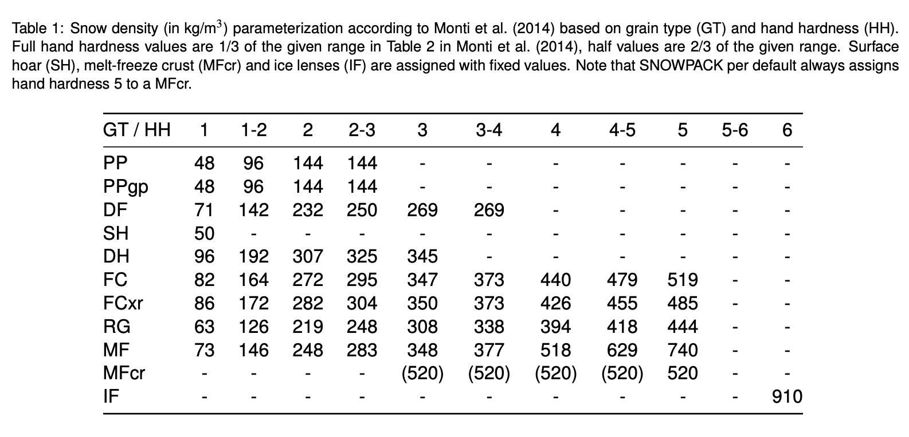

# Caaml v6 processor

This processor can prepare CAAMLv6 snow profile files for initializing Snowpack simulations. It checks for required parameters (temperature, grain size, ...), parameterizes a density profile if required and sets required/optional metadata for the simulation.

## Density parameterization a la Monti

Typically, under operational avalanche forecasting constraints, density is not directly measured for observed snow profiles. However, together with temperature and the liquid water content, density is a necessary input variable of the snow cover model to describe individual snow layers when initializing the model and simulate their evolution. Therefore, this processor provides the option to parameterize the snow density with the following table using the snow layer's grain type and hand hardness, both standard parameters measured during traditional operational snow profiling. The lookup table is based on Monti et al. (2014) and closely related to Table 2 in their publication. Since the resolution of operational density measurements is often too coarse or not taken layer-wise to resolve thin weak layers or crusts, it is recommended to parameterize the density even when snow density measurements are available.

  

## Relevant references

Monti, Fabiano & Schweizer, Juerg & Fierz, Charles. (2014). Hardness estimation and weak layer detection in simulated snow stratigraphy. Cold Regions Science and Technology. 103. 10.1016/j.coldregions.2014.03.009.