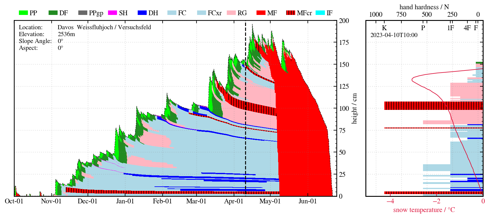
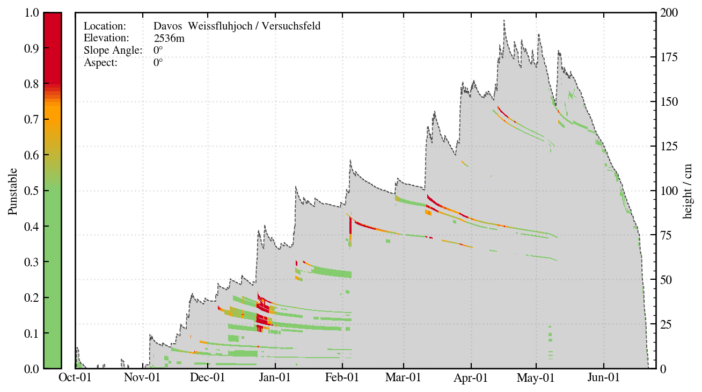
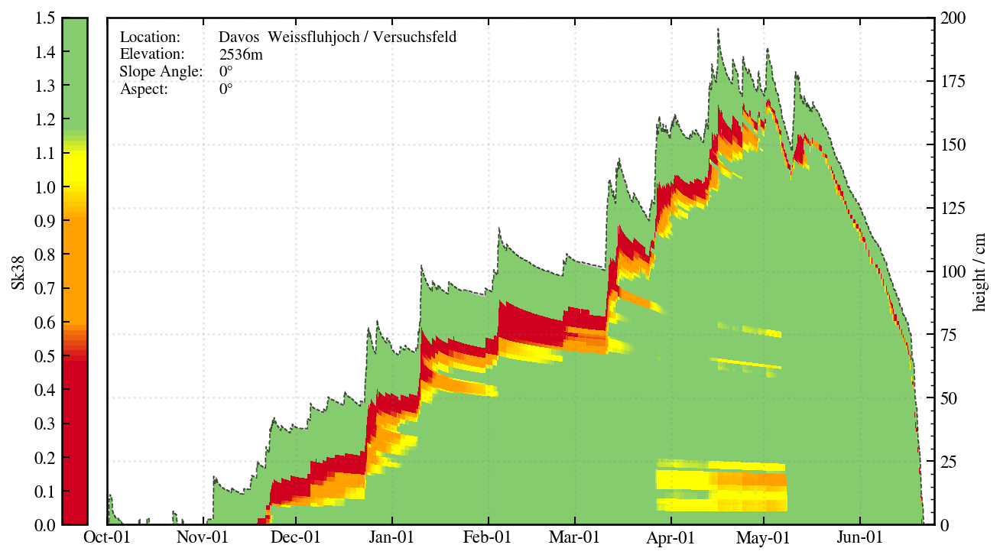

# Snowpro

**Snowpro** is a module of the Python package snowpacktools and visualizes .PRO-files, the snow stratigraphy output of SNOWPACK. So far it contains an approach to visualize snow profile data over time using matplotlib axes.bar(). The read-in function generates a dictionary with timestamps as keys and another dictionary holding the snow profile (arrays of different variables). The dictionary can be filtered for a certain resolution or hour of the day. 

Snowpro also includes Stephanie Mayer's Punstbale random forest model. The instability index is calculated by stacking all timestamps. It makes the computation quite fast. This happens in 'instability_rfm_mayer.py'.

## Pro-parser
The default pro-parser currently returns a dictionary of dictionaries with keys representing different timestamps and the nested dictionaries represent the individual snow profiles with keys for different variables and values being the arrays covering all the layers of the snow profile. Check out the function read_pro() in 'snowpro.py'. It was originally based on Bettina Richter's pro-parser used at SLF. 

For Avapro there's also a pandas version (read_pro_pd()). Its slower, but a list of dataframes makes postprocessing of the data quite intuitive and within notebooks Pandas dataframes are quite nice to look at and work with. Lists (can be sorted) might also be helpful to visualize different profiles sorted by height not time (like in Horton paper). Avapro is currently updated to work with the dictionary version of Snowpro.

## Usage
Snowpro can be installed and imported via the snowpacktools package. Then it is available throughout the python environment. Plotting the snowpack evolution or a single snow profile for a certain PRO file works directly from the Terminal via the following statements, if one is in the same folder as snowpro.py:

'python snowpro.py snowpro.ini'
'python snowpro.py +PATH_TO_INI_FILE+ +PATH_TO_PRO_FILE(optional)+'

Alternatively, the package or only the Snowpro module of snowpacktools can be imported within other python scripts.

Use the snowpro.ini file to define which plots should be produced and for setting relevant parameters like paths, resolution, color scheme, date, ...

## Functionalities
- Read-in of PRO files robust (Timestamps without snowprofiles can be handled, soil data can be handled)
- SARP colormaps for grain type
- Surface hoar at surface
- Soil layers are handled, but not yet plotted for LWC
- Second layer for indices possible (compare figures)
- SNP evolution plus single snow profiles (hand hardness profiles) possible

## Roadmap / Dev-plans
- Include visualization of CAAMLv6 snow profiles within snowpacktools in general
- Possibility to plot soil layers!! so far snowpro can deal with these pro files, but it can not plot soil layers

## Visualization

Happens in 'pro_plotter.py'.

Atm I think bar-plots are the best solution for plotting the snowpack evolution. Depending on the size of the PRO file and the resolution computing time is not ideal for quick data analysis, but it is not the goal to copy niViz. Preparing large matrices and only calling ax.bar() once has been tried, but computing time increased. pcolor or pcolormesh could be faster, but it might be hard to obtain a similar clean look?!

Some example visualizations:

  

  

  

  

## Relevant references

Mayer, S., van Herwijnen, A., Techel, F., and Schweizer, J. (2022). A random forest model to assess snow instability from simulated snow stratigraphy, The Cryosphere, 16, 4593–4615, https://doi.org/10.5194/tc-16-4593-2022.