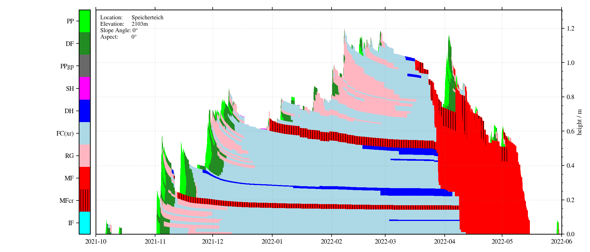
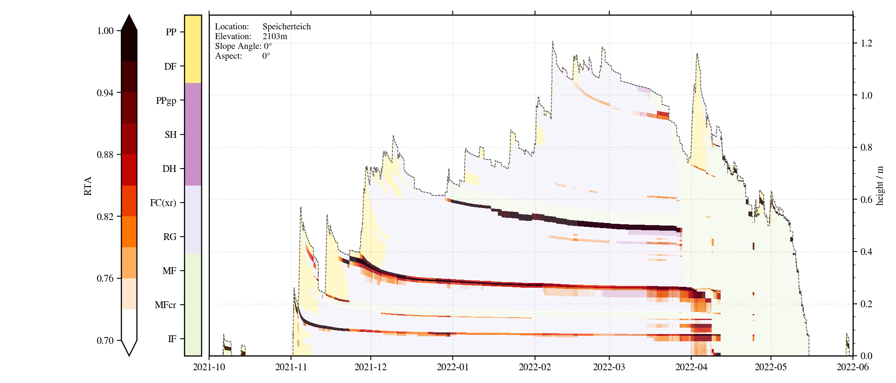
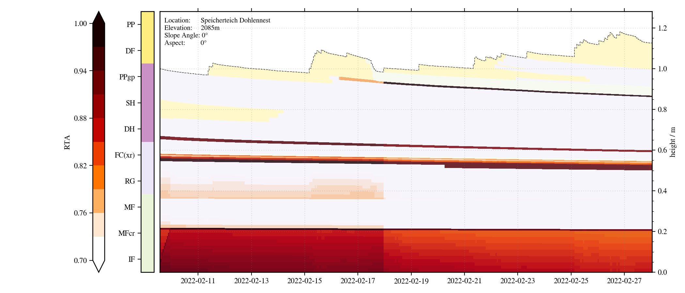
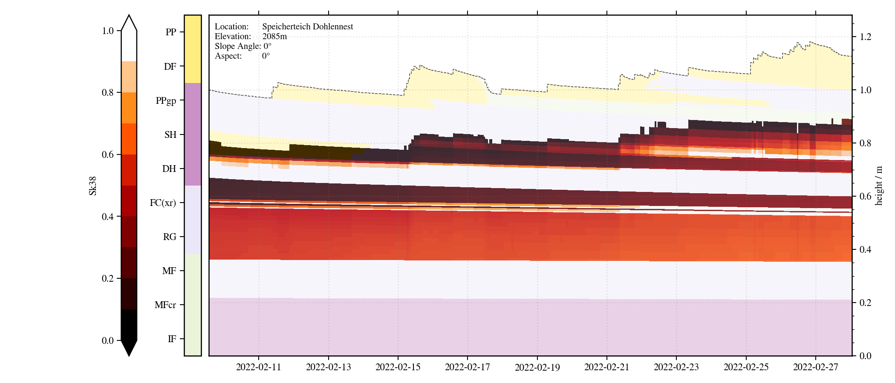

# Snowpro

The goal of **Snowpro** is the development of a Python package to work with and visualize .PRO files (snow stratigraphy output of Snowpack). So far it contains an approach to visualize snow profile data over time using matplotlib axes.bar(). The read-in function generates a list of Pandas dataframes. One df for each timestamp. These lists can be filtered for a certain resolution or hour of the day. 

A list of dataframes makes postprocessing of the data quite intuitive and within notebooks Pandas dataframes are quite nice to look at and work with. Lists (can be sorted) might also be helpful to visualize different profiles sorted by height not time (like in Horton paper).

Atm I think bar-plots are the best solution for plotting the snowpack evolution. Depending on the size of the PRO file and the resolution computing time is not ideal for quick data analysis, but it is not the goal to copy niViz. Preparing large matrices and only calling ax.bar() once has been tried, but computing time increased.

  

  

  

  

## Usage
Snowpro can now be installed and imported via the snowpacktools package. Then it is available throughout the python environment. Plotting the snowpack evolution or a single snow profile for a certain PRO file works directly from the Terminal via the following statements, if one is in the same folder as snowpro.py:

'python snowpro.py snowpro.ini'
'python snowpro.py +PATH_TO_INI_FILE+ +PATH_TO_PRO_FILE(optional)+'

Alternatively, the package or only the Snowpro module of snowpacktools can be imported within other python scripts.

Use the snowpro.ini file to define which plots should be produced and for setting relevant parameters like paths, resolution, color scheme, date, ...

## Functionalities
- Read-in of PRO files robust (Timestamps without snowprofiles can be handled, soil data can be handled)
- SARP colormaps for grain type
- Surface hoar at surface
- Soil layers are handled, but not yet plotted for LWC
- Second layer for indices
- SNP evolution plus single snow profiles (hand hardness profiles) possible

## Roadmap
- Include visualization of CAAMLv6 snow profiles within snowpacktools in general

- Add plot for showing avalanche problems from Avapro combined with snowpack evolution?
- Possibility to plot soil layers!! so far snowpro can deal with these pro files, but it can not plot soil layers
- CONSIDER: Enhancing the operational value of snowpack models with visualization design principles (Horton, 2020)
https://nhess.copernicus.org/articles/20/1557/2020/

## Authors and acknowledgment
Lawinenwarndienst Tirol
(Michi Binder)

Loading PRO file data into list of dataframes is based on Robbie Mallett's approach (https://github.com/robbiemallett/pyniviz), but significantly adapted and generalized for snow and avalanche research specific files.
